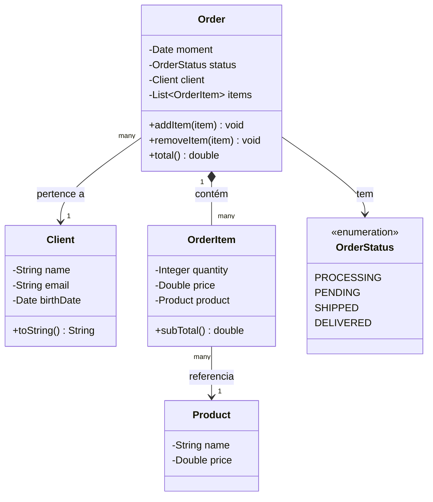

# Composition — Order / OrderItem / Product / Client

Exercício sobre **composição de objetos**: um `Order` (pedido) é formado por vários `OrderItem`, e cada item referencia um `Course`. Diferente de herança, aqui as classes não têm relação "é um", e sim "tem um" — um pedido *tem* um cliente, *tem* vários itens.

**Ponto-chave:** repare no `*--` entre `Order` e `OrderItem` — é composição forte: um `OrderItem` não faz sentido sem existir dentro de um `Order`. Já `OrderItem --> Product` é uma associação mais fraca: o mesmo `Course` pode estar em vários pedidos diferentes.

