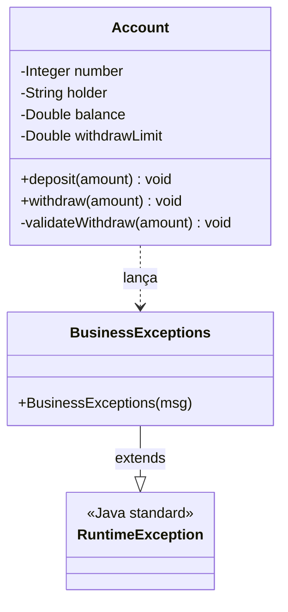

# ExceptionHandling — Account / BusinessExceptions

Exercício sobre **tratamento de exceções customizadas**: uma conta bancária valida saque com regras de negócio próprias, lançando uma exceção customizada (`BusinessExceptions`) em vez de deixar o programa quebrar com uma exceção genérica.

**Ponto-chave:** `BusinessExceptions` estende `RuntimeException` (exceção *unchecked*) — não precisa de `throws` na assinatura do método nem de bloco `try/catch` obrigatório em quem chama. Isso é uma escolha de design: erros de regra de negócio (limite excedido, saldo insuficiente) são tratados como erros de execução, não como condições que o chamador é forçado a prever.

> ⚠️ Atenção ao revisar: em `validateWithdraw`, a condição `if (amount < getWithdrawLimit())` parece invertida — o esperado seria lançar erro quando o valor **excede** o limite (`amount > getWithdrawLimit()`), não quando é menor. Vale conferir essa regra.
