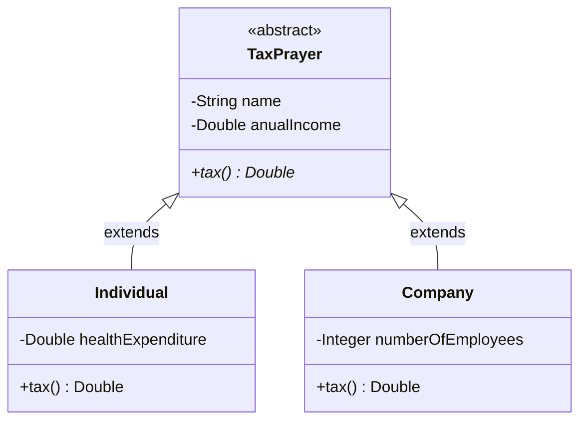

# Inheritance2 — TaxPrayer / Individual / Company

Exercício sobre **herança e polimorfismo com classe abstrata**: `TaxPrayer` define o comportamento comum (nome, renda anual) e obriga as subclasses a implementar `tax()` — cada uma com sua própria regra de cálculo de imposto.

**Regras de negócio implementadas:**
- `Individual.tax()`: 15% da renda se renda < 20.000, senão 25% — em ambos os casos, subtrai metade dos gastos com saúde.
- `Company.tax()`: 14% da renda se mais de 10 funcionários, senão 16%.

**Ponto-chave:** `tax()` é declarado `abstract` em `TaxPrayer` — a classe não sabe *como* calcular, só garante que toda subclasse *saiba* calcular. Isso é herança com polimorfismo: você pode tratar uma lista de `TaxPrayer` (misturando `Individual` e `Company`) e chamar `tax()` em cada um, sem se importar com o tipo concreto.
