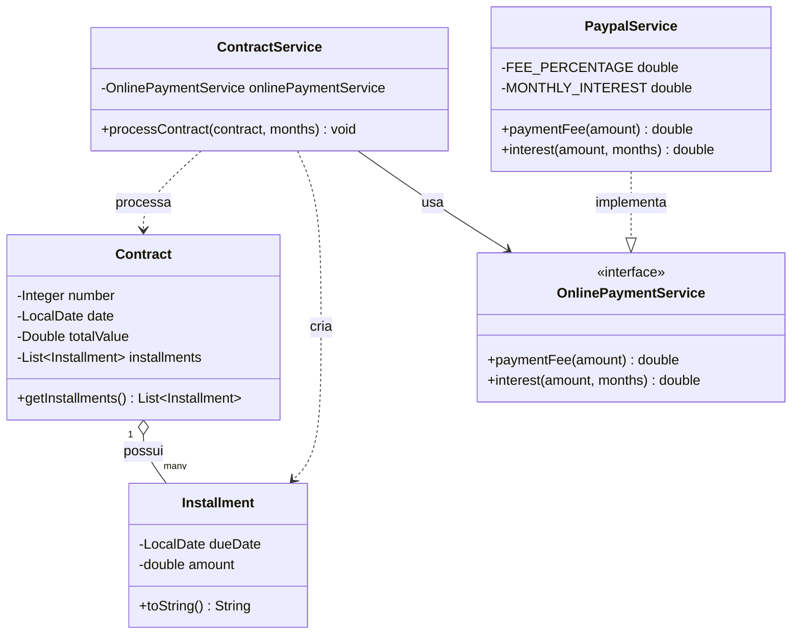

# Interfaces — Contract / Installment

Exercício sobre **interfaces e injeção de dependência**: um contrato é dividido em parcelas, e o cálculo de juros/taxa é delegado a um serviço de pagamento que pode variar (`PaypalService` é uma das implementações possíveis de `OnlinePaymentService`).

O `ContractService` depende apenas da interface `OnlinePaymentService`, nunca de uma implementação concreta — isso permite trocar o serviço de pagamento sem alterar a lógica de cálculo das parcelas.

**Ponto-chave:** a seta pontilhada `ContractService --> OnlinePaymentService` (dependência de abstração) é diferente da seta `PaypalService ..|> OnlinePaymentService` (implementação). É essa distinção que permite polimorfismo — trocar `PaypalService` por outro serviço sem tocar em `ContractService`.
